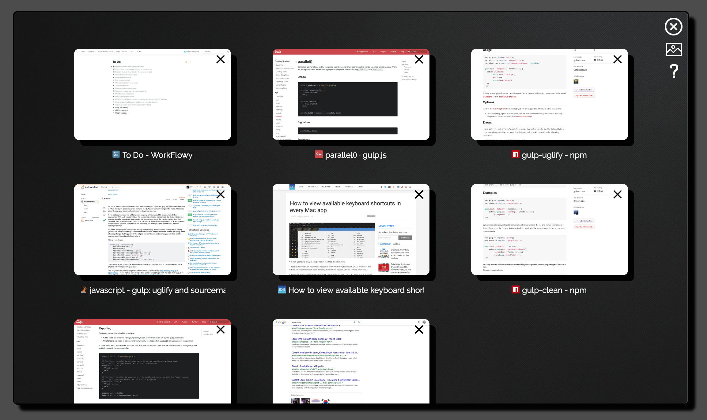
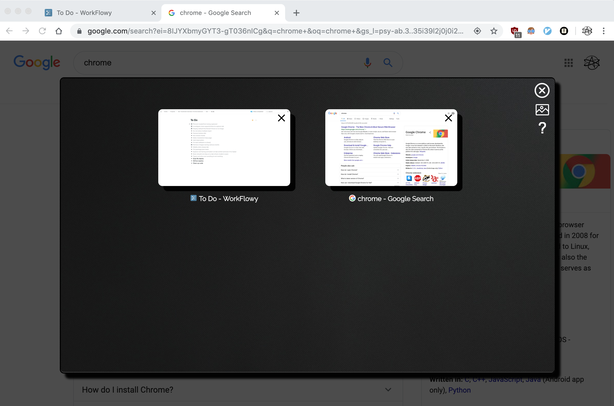

# TabView

[Chrome Webstore Page](https://chrome.google.com/webstore/detail/tabview/mdbhlojiglbmhhmdcepaloomhjicbiga?hl=en-US)

TabView is a chrome extension that lets you visually and interactively browse
your tabs.

## Dev Stuff

TabView works by using the `chrome.tabs.captureVisibleTab` API as you 
navigate tabs. The screenshots are stored directly in `chrome.storage.local`
as a [data URI](https://en.wikipedia.org/wiki/Data_URI_scheme). When the 
browser action is clicked, an iframe is injected into the current page as 
an overlay, which then queries all open tabs in the window and fetches their
thumbnails from storage.

Since only visible tabs can be captured, tabs which have never been navigated
to do not have screenshots and instead display a default image in the iframe.
For convenience, the scan button (second in top right of iframe) navigates to
every tab in the current window and captures it.

Refer to the _Create Manifest_ section of 
[this documentation](https://developer.chrome.com/extensions/getstarted) for
details on how to load the source code into chrome.

## Screenshots

